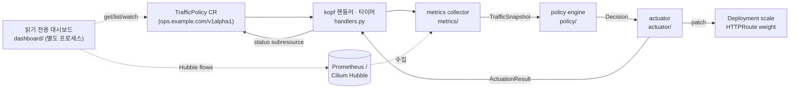

# samsung — Kubernetes 트래픽 기반 자동운영 오퍼레이터

> Pod의 CPU/메모리가 아니라 **서비스 트래픽(RPS · 에러율 · 지연시간)** 을 기준으로
> Kubernetes를 자동 운영하는 Python [kopf](https://kopf.readthedocs.io/) 오퍼레이터.

Gateway API(HTTPRoute)로 관측되는 실제 트래픽 지표를 1급 신호로 삼아 **스케일링 ·
장애 감지 · 라우팅 격리/복구 · 이상 탐지**를 자동 수행한다. Gateway 메트릭이 없는
클러스터를 위해 **Cilium Hubble(CNI)** 기반 대안 소스도 지원하며, 운영 현황을 보는
읽기 전용 웹 대시보드가 함께 제공된다.

---

## 목차

- [왜 트래픽 기반인가](#왜-트래픽-기반인가)
- [핵심 기능](#핵심-기능)
- [아키텍처](#아키텍처)
- [동작 방식](#동작-방식)
- [저장소 구조](#저장소-구조)
- [TrafficPolicy CRD](#trafficpolicy-crd)
- [모듈 간 계약](#모듈-간-계약)
- [시작하기](#시작하기)
- [클러스터 배포 — ArgoCD (GitOps)](#클러스터-배포--argocd-gitops)
- [대시보드](#대시보드)
- [지원 Gateway API 구현체](#지원-gateway-api-구현체)
- [대안 트래픽 소스: Cilium Hubble](#대안-트래픽-소스-cilium-hubble)
- [안전장치](#안전장치)
- [테스트](#테스트)
- [개발 하네스](#개발-하네스)

---

## 왜 트래픽 기반인가

리소스 사용률(CPU/메모리)은 **원인일 뿐 결과가 아니다** — 사용자가 실제로 겪는 것은
요청 실패율과 응답 속도다. 이 오퍼레이터는 RPS/에러율/지연시간을 판단의 1급 신호로
삼으며, **CRD 어디에도 CPU/메모리 임계값이 존재하지 않는다.** 스케일 판단의 분모는
"Ready 파드당 RPS"이고, 격리 판단은 backend별 에러율이다.

## 핵심 기능

- **트래픽 기반 스케일링** — 파드당 RPS가 목표치를 초과/미달하면 replica 조정.
  스케일업/다운 임계값을 분리해 flapping을 막는다.
- **이상 탐지** — 정적 임계값(CRD 명시값) + EWMA baseline 이탈(z-score)의 조합.
- **라우팅 격리·복구** — 에러가 특정 backend에 집중되면 HTTPRoute weight를 낮춰 격리하고,
  해소되면 점진적으로(reroute) 복구한다.
- **안전장치** — cooldown, hysteresis, 변경 폭 제한, idempotent patch, dry-run.
- **관측** — 읽기 전용 대시보드에서 정책 판단 현황 + Cilium Hubble 실시간 Pod 트래픽 흐름.

## 아키텍처



`metrics → policy → actuator` 세 모듈은 [모듈 간 계약](#모듈-간-계약)(`schemas.py`의
dataclass)으로만 연결되며, 대시보드는 오퍼레이터 본체와 **완전히 분리된 별도 프로세스**로
동작한다(클러스터에 아무것도 쓰지 않음).

## 동작 방식

1. **수집** — `TrafficPolicy` CR의 `spec.target`(HTTPRoute/Deployment)과 `spec.window`로
   메트릭을 조회해 `TrafficSnapshot`(전체·backend별 RPS/에러율/지연, Ready 파드 수)을 만든다.
   `status`가 `ok`가 아니면(`no_data`/`collection_failed`) 판단을 건너뛴다(안전).
2. **판단** — policy 엔진이 스냅샷을 임계값 + EWMA baseline과 비교해 하나의 `Decision`을 낸다.
   `action`은 다음 중 하나다:
   | action | 의미 |
   |---|---|
   | `noop` | 변경 없음(임계값 이내 또는 cooldown 중) |
   | `scale` | `target_replicas`로 Deployment replica 조정 |
   | `isolate_backend` | 에러 집중 backend의 HTTPRoute weight를 낮춰 격리 |
   | `reroute` | 격리 해소 시 weight를 점진 복구 |
3. **실행** — actuator가 `Decision`을 실제 리소스 패치로 반영하고 `ActuationResult`를 돌려준다.
   변경 폭 clamp(min/max replica, maxScaleStep)·idempotent 확인·dry-run이 여기서 적용된다.
4. **기록** — kopf 핸들러가 판단/실행 결과를 CR의 `status` 서브리소스에 남기고, 대시보드가 이를 읽어 보여준다.

## 저장소 구조

```
operator/
├── crds/trafficpolicy.yaml            # TrafficPolicy CRD (원본)
├── k8s_traffic_operator/
│   ├── schemas.py                     # 모듈 간 공유 계약(TrafficSnapshot/Decision/ActuationResult)
│   ├── main.py                        # kopf 엔트리포인트 (kopf run -m k8s_traffic_operator.main)
│   ├── handlers.py                    # kopf 핸들러/타이머(reconcile 배선)
│   ├── hubble_client.py               # Hubble 조회 공용 클라이언트(정책·대시보드 공유)
│   ├── metrics/                       # 트래픽 메트릭 수집
│   │   ├── collector.py               #   구현체 선택 + 정규화
│   │   ├── prometheus_client.py       #   Prometheus HTTP API
│   │   ├── hubble_collector.py        #   Cilium Hubble 소스(대안)
│   │   └── adapters/                  #   envoy_gateway · istio · nginx_gateway_fabric
│   ├── policy/                        # 판단 엔진
│   │   ├── engine.py                  #   Decision 산출(스케일/격리/복구 통합)
│   │   ├── scaling.py                 #   파드당 RPS 기반 스케일 계산(hysteresis)
│   │   ├── anomaly.py · baseline.py   #   z-score 이상탐지 + EWMA baseline
│   ├── actuator/                      # 실행기
│   │   ├── executor.py                #   Decision → 리소스 패치 배선
│   │   ├── scaler.py                  #   Deployment replica 패치(clamp/idempotent)
│   │   └── router.py                  #   HTTPRoute backendRefs weight 패치
│   └── dashboard/                     # 읽기 전용 웹 UI (별도 프로세스)
│       ├── app.py                     #   FastAPI 라우트 + 로그인/설정
│       ├── auth.py                    #   파일 기반 자격증명 저장소 + 세션
│       ├── data.py                    #   TrafficPolicy 현황 조회
│       └── hubble_flows.py            #   Hubble 실시간 Pod 트래픽 흐름
├── Dockerfile · Dockerfile.dashboard  # 오퍼레이터 본체 / 대시보드 이미지
├── deploy/k8s/                        # ArgoCD가 동기화하는 GitOps 매니페스트(단일 소스)
│   ├── 00-crd.yaml                    #   CRD 배포용 사본(원본: crds/trafficpolicy.yaml — 동기화 필수)
│   ├── 10-operator.yaml               #   오퍼레이터 본체(ClusterRole/Deployment, 전역 감시)
│   ├── 20-dashboard.yaml              #   대시보드(SA/RBAC/Deployment/Service/HTTPRoute/PVC)
│   └── 21-...secret...template        #   대시보드 부트스트랩 자격증명 Secret 예시(선택 · 미동기화)
├── deploy/argocd/traffic-ops.yaml     # ArgoCD Application(위 디렉터리를 main에서 동기화)
└── tests/                             # pytest 회귀 테스트 (253개)
```

## TrafficPolicy CRD

`ops.example.com/v1alpha1`, `kind: TrafficPolicy`. 필수: `target`, `thresholds`, `actions`, `window`.

| 경로 | 타입 | 기본값/제약 | 설명 |
|---|---|---|---|
| `target.httpRoute` | string | | 메트릭을 읽을 HTTPRoute 이름 |
| `target.namespace` | string | | 대상 네임스페이스 |
| `target.deployment` | string | | 스케일 대상 Deployment |
| `thresholds.targetRPSPerPod` | number | ≥0 | 파드당 목표 RPS(스케일업 기준) |
| `thresholds.scaleDownRPSPerPod` | number | ≥0 | 파드당 스케일다운 기준(분리로 flapping 방지) |
| `thresholds.scaleUpErrorRate` | number | 0.0–1.0 | 이 에러율 초과 시 대응(비율, %가 아님) |
| `thresholds.maxP99LatencyMs` | number | ≥0 | p99 지연 상한(ms) |
| `actions.minReplicas` | integer | ≥0 | replica 하한 |
| `actions.maxReplicas` | integer | ≥1 | replica 상한 |
| `actions.cooldownSeconds` | integer | ≥0 | 연속 변경 사이 최소 대기(flapping 방지) |
| `actions.maxScaleStep` | integer | ≥1 | 한 번에 바꿀 수 있는 최대 replica 폭 |
| `actions.allowRouteIsolation` | boolean | `false` | true여야 격리/복구(reroute)가 동작 |
| `window` | string | `1m` | 메트릭 집계 관측 윈도우 |

```yaml
apiVersion: ops.example.com/v1alpha1
kind: TrafficPolicy
metadata:
  name: checkout-traffic-policy
spec:
  target:
    httpRoute: checkout-route
    namespace: shop
    deployment: checkout-service
  thresholds:
    targetRPSPerPod: 50
    scaleDownRPSPerPod: 20
    scaleUpErrorRate: 0.05
    maxP99LatencyMs: 800
  actions:
    minReplicas: 2
    maxReplicas: 20
    cooldownSeconds: 120
    maxScaleStep: 4
    allowRouteIsolation: true
  window: "1m"
```

## 모듈 간 계약

`schemas.py`의 dataclass가 모듈 경계면의 유일한 인터페이스다.

- **`TrafficSnapshot`** — metrics → policy. `status`(`ok`/`no_data`/`collection_failed`),
  `timestamp`, `window_seconds`, 전체 `rps`/`error_rate`/지연, `total_ready_pods`,
  `per_backend: List[BackendTraffic]`(격리 판단용).
- **`Decision`** — policy → actuator. `action`(`noop`/`scale`/`reroute`/`isolate_backend`),
  `reason`, `target_replicas`, `backend_weights`, `severity`(`none`/`warning`/`critical`),
  `anomaly_score`, `cooldown_until`.
- **`ActuationResult`** — actuator → 핸들러. `applied`, `action`, `detail`, `dry_run`, `error`.

## 시작하기

```bash
cd operator
python3 -m venv .venv
./.venv/bin/pip install -r requirements.txt

# 테스트 실행 (253개)
./.venv/bin/pytest

# 로컬 실행 (operator/ 디렉토리에서, 모듈 모드)
./.venv/bin/kopf run -m k8s_traffic_operator.main --verbose
```

## 클러스터 배포 — ArgoCD (GitOps)

이 클러스터는 배포를 **ArgoCD**로 한다. `operator/deploy/k8s` 디렉터리 하나가 전체 스택
(CRD + 오퍼레이터 + 대시보드)의 GitOps 소스이고, `operator/deploy/argocd/traffic-ops.yaml`의
Application이 `main`을 자동 동기화한다(`automated: prune + selfHeal` — **git이 유일한 진실,
수동 `kubectl` 변경은 되돌려진다**).

```bash
# ArgoCD Application 최초 등록(한 번만)
kubectl apply -f operator/deploy/argocd/traffic-ops.yaml

# (선택) 대시보드 부트스트랩 자격증명 Secret — 없어도 기본 admin/password로 기동한다.
# 있으면 자격증명 파일이 처음 만들어질 때 이 값으로 시드된다(이후엔 /settings에서 변경).
# 값은 git에 커밋하지 않으며 배포자가 직접 생성한다(조직 정책: 자격증명 비커밋).
kubectl -n traffic-policy-dashboard create secret generic traffic-policy-dashboard-auth \
  --from-literal=username='<아이디>' --from-literal=password='<강력한 비밀번호>'
```

**코드 변경 배포(GitOps 흐름)** — `:latest`가 아니라 **버전 태그**를 쓴다:

```bash
# 1) 새 버전으로 이미지 빌드·푸시
docker build -f Dockerfile.dashboard -t registry.local.cloud:5000/traffic-policy-dashboard:v0.1.3 .
docker push registry.local.cloud:5000/traffic-policy-dashboard:v0.1.3
# 2) deploy/k8s/20-dashboard.yaml(또는 10-operator.yaml)의 image 태그를 올려 커밋·push
# 3) ArgoCD가 main을 감지해 자동 동기화 → 새 이미지로 롤아웃
```

오퍼레이터 본체는 `-A`(전체 네임스페이스) 모드로 배포된다 — 어떤 네임스페이스에
TrafficPolicy CR이 생길지 미리 알 수 없으므로 ClusterRole이 필요하다. 쓰기 권한(Deployment
scale, HTTPRoute weight)은 각 CR의 `spec.target`에 실제로 명시된 리소스에만 적용된다.

## 대시보드

읽기 전용 웹 UI가 `operator/k8s_traffic_operator/dashboard/`에 있다. 오퍼레이터 본체와
별도 프로세스로 동작하며 클러스터에 아무것도 쓰지 않는다(조회만).

- **`/` — 실시간 Pod 트래픽 흐름(메인)**: Cilium Hubble이 관측한 실제 Pod 간 L3/L4 연결을
  멀티홉 그래프로 시각화(방향·연결 수·verdict, 네임스페이스/리소스 필터). HTTP 요청수/RPS가
  아니라 연결 단위 데이터이므로 아래 정책 판단과는 성격이 다르다. (`/flows`는 하위호환 별칭.)
- **`/policies` — TrafficPolicy 현황**: 각 CR의 phase, 마지막 판단(action/reason/severity),
  실제 적용 여부. Gateway API 트래픽 메트릭 기반 오퍼레이터 판단 결과다.
- **`/api/flows`, `/api/policies`** — 위 데이터의 JSON. `/healthz` — 프로브(인증 예외).

**인증** — 공개 호스트로 노출되므로 앱 레벨 로그인(폼 + HMAC 서명 세션 쿠키)으로 보호한다.
기본 자격증명은 **admin / password**이며, 로그인 후 **`/settings`** 에서 아이디·비밀번호를
바꿀 수 있다(비밀번호는 PBKDF2 해시로 저장, 변경은 PVC에 영속돼 재기동에도 유지). 스크립트/API
접근용으로 저장된 값과 일치하는 HTTP Basic도 허용한다. **배포 후 `/settings`에서 기본
비밀번호를 반드시 변경할 것.** 더 강한 통제가 필요하면 앞단에 OAuth 프록시/IP 제한을 검토한다.

```bash
# 로컬에서
cd operator
./.venv/bin/uvicorn k8s_traffic_operator.dashboard.app:app --reload
# http://localhost:8000 (메인=트래픽 흐름), http://localhost:8000/policies (정책 현황)
# 기본 로그인 admin/password (DASHBOARD_CREDENTIALS_PATH 미설정 시 메모리로만 동작 → 재기동 시 초기화)
```

환경변수: `WATCH_NAMESPACE`(비우면 전체), `DASHBOARD_URL_PREFIX`(서브패스 노출 시),
`DASHBOARD_CREDENTIALS_PATH`(자격증명 저장 파일), `HUBBLE_RELAY_ADDR`.

## 지원 Gateway API 구현체

Envoy Gateway · Istio · nginx Gateway Fabric. 새 구현체는
`operator/k8s_traffic_operator/metrics/adapters/`에 어댑터를 추가하면 된다
(`base.GatewayAdapter` 참조). NGINX Plus API는 latency percentile을 제공하지 않아
p95/p99는 의도적으로 `None`이다.

## 대안 트래픽 소스: Cilium Hubble

Gateway API 구현체가 트래픽 메트릭을 노출하지 않는 클러스터에서도, Cilium/Hubble이 떠
있으면(`enable-hubble: "true"`) 정책 엔진이 CNI 레벨에서 실제 Pod 트래픽을 보고 스케일링을
판단할 수 있다. `GATEWAY_IMPLEMENTATION=cilium-hubble` 환경변수로 켠다.

```bash
GATEWAY_IMPLEMENTATION=cilium-hubble \
HUBBLE_RELAY_ADDR=hubble-relay.kube-system.svc.cluster.local:80 \
kopf run -m k8s_traffic_operator.main
```

**이 경로의 값 의미는 Gateway API 경로와 다르다**(자세한 건 `metrics/hubble_collector.py` docstring):

- `rps` = 대상 Deployment로 향한 **L3/L4 연결(flow) 수 / 윈도우 초** — HTTP 요청 수가 아님.
- `error_rate` = verdict가 FORWARDED가 아닌 연결의 비율 — HTTP 5xx 비율이 아님(정책 없으면 사실상 0).
- 지연시간(p50/p95/p99)과 per_backend는 제공되지 않는다 → **스케일링·전체 이상탐지만** 지원,
  `isolate_backend`/`reroute`는 이 경로로 트리거되지 않는다(backendRef 매핑 불확실성 회피).

대상은 CRD의 `target.namespace` + `target.deployment`로 특정한다(HTTPRoute 미사용).
`hubble` CLI 버전은 클러스터의 Cilium 버전과 맞아야 한다(다르면 "invalid fieldmask" 오류).
대시보드/오퍼레이터 이미지에 포함되는 버전은 `Dockerfile*`의 `HUBBLE_CLI_VERSION`으로 고정한다.

## 안전장치

- **cooldown** — `actions.cooldownSeconds` 이내 연속 변경 금지(`Decision.cooldown_until`).
- **hysteresis** — 스케일업/다운 임계값 분리로 경계에서의 진동 방지.
- **변경 폭 제한** — `maxScaleStep` + `min/maxReplicas` clamp(actuator에서 강제).
- **idempotent patch** — 이미 목표 상태면 쓰지 않는다.
- **dry-run** — 실제 쓰기 없이 판단/실행 경로 검증(`ActuationResult.dry_run`).
- **수집 실패 안전** — `no_data`/`collection_failed` 스냅샷에서는 어떤 대응도 하지 않는다.

## 테스트

```bash
cd operator && ./.venv/bin/pytest        # 253개
```

kubernetes client는 MagicMock, Prometheus/Hubble는 주입 지점에서 mock한다 — 실제
클러스터/kopf 이벤트 루프 E2E는 범위 밖이며, 인라인이 아닌 정식 회귀 스위트로 고정돼 있다.

## 개발 하네스

이 프로젝트는 5개 전문 에이전트(설계 · 메트릭 · 정책 · 실행 · QA)와 오케스트레이터 스킬로
구성된 하네스로 만들어졌다. 하네스 구성과 전체 변경 이력은 [CLAUDE.md](CLAUDE.md)를 참조.
